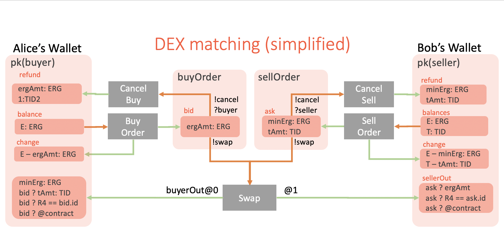

# Trustless Decentralized Exchange on Ergo

## Introduction

Centralized exchanges are popular, have high assets liquidity and are easy to use,
but unfortunately they may be [hacked](https://coinsutra.com/biggest-bitcoin-hacks/).

[Decentralized Exchanges](https://en.wikipedia.org/wiki/Decentralized_exchange) (aka
DEXes) are gaining popularity and promising better security, but they are harder to use,
have lower liquidity and come with their own drawbacks.

Programming model of Ergo smart contracts is quite powerful which is demonstrated by [many
examples](https://ergoplatform.org/docs/ErgoScript.pdf) including more [advanced potential
applications](https://ergoplatform.org/docs/AdvancedErgoScriptTutorial.pdf), those are
published around a time the network was launched.
What was missing is the concrete recipe, a step-by-step guidance and tools to put conceptual
design of smart contracts into working application running on Ergo blockchain.

In this [Appkit](https://ergoplatform.org/en/blog/2019_12_03_top5/) and
[ErgoTool](https://ergoplatform.org/en/blog/2019_12_31_ergo_tool/) series of posts we aim
to fill this gap and give updates on both new network and tooling development.

Ergo have expressive smart contracts and transaction model which allows an
implementation of fully trustless DEX protocol, in which signed buy and sell orders can be
put into the blockchain independently by buyers and sellers. An off-chain matching
service can observe the Ergo blockchain, find matching orders and submit the swap
transaction without knowing any secrets. The matching can be incentivized by _DEX reward_
payed as part of a _swap transaction_. Anyone who first discover the match of the two
orders can create the swap transaction and get a reward in ERGs.

In this post we describe a simple yet functional implementation of DEX protocol as a
command line interface (CLI) utility using [ErgoTool Commands
Framework](https://github.com/aslesarenko/ergo-tool).

## DEX Transactions Overview



## Issue A New Token

The first operation in the lifecycle of a new token is its issue.
Ergo natively support issue, storage and transfer of tokens. New tokens can be issued
according to the [Assets
Standard](https://github.com/ergoplatform/eips/blob/master/eip-0004.md).

The following ErgoTool command allows to issue a new token on the Ergo blockchain.
```
$ ergo-tool help dex:IssueToken
Command Name:	dex:IssueToken
Usage Syntax:	ergo-tool dex:IssueToken <wallet file> <ergAmount> <tokenAmount> <tokenName> <tokenDesc> <tokenNumberOfDecimals>
Description:	issue a token with given <tokenName>, <tokenAmount>, <tokenDesc>, <tokenNumberOfDecimals> and <ergAmount> with the given <wallet file> to sign transaction (requests storage password)
Doc page:	https://aslesarenko.github.io/ergo-tool/api/org/ergoplatform/appkit/ergotool/dex/IssueTokenCmd.html
```

A token is issued by creating a new box with the `ergAmount` of ERGs and
(`tokenId`, `tokenAmount`) pair in the `R2` register, where `tokenId` is selected
automatically using the id of the first input box of the transaction (as required by Ergo
protocol). Additional registers should also be specified as required by
[EIP-4](https://github.com/ergoplatform/eips/blob/master/eip-0004.md) standard.
The `dex:IssueToken` command uses a wallet storage given by `storageFile` to transfer given `ergAmount` of ERGs
to a new box with tokens. The new box will belong the same wallet given by `storageFile`.

Here is an example of using `dex:IssueToken` -
https://gist.github.com/greenhat/47fc2a4190ba8874248a3f759f645f1b

## Sell Tokens

If we have tokens in a box we can sell them. Well, at least we can create an Ask order and submit it
to the order book. In our DEX implementation we create orders and store them directly on the Ergo
blockchain. The created order in our case is a box (seller box) protected with the special _seller
contract_ holding the minimum amount of ERGs (`minErg`) and `tokenAmount` of the `TID` tokens.

```scala
  /** Seller's contract for DEX
    * @param ergAmount nanoERG amount seller wants to receive for the tokens
    * @param pkB public key of the seller
    * @return compiled contract
    */
  def seller(ctx: Context, ergAmount: Long, pkB: SigmaProp): SigmaProp = {
    import ctx._
    pkB || (
      OUTPUTS.size > 1 &&
      OUTPUTS(1).R4[Coll[Byte]].isDefined
    ) && {
      val knownBoxId = OUTPUTS(1).R4[Coll[Byte]].get == SELF.id
      OUTPUTS(1).value >= ergAmount &&
      knownBoxId &&
      OUTPUTS(1).propositionBytes == pkB.propBytes
    }
  }
```
The contract is implemented in [the
repository](http://github.com/ergoplatform/ergo-contracts/blob/391912fbd466c1b262e8d2fa61d4bfd94981df4a/verified-contracts/src/main/scala/org/ergoplatform/contracts/AssetsAtomicExchange.scala#L41-L58)
of certified contracts.

The seller contract guarantees that the seller box can be spent:
1) by seller itself, which is the way for a seller to [cancel the order](#canceling-the-orders)
2) by a _swap transaction_ created by Matcher in which _seller box_ is spent together (i.e.
atomically) with the matched _buyer box_ (see [buy tokens](#buy-tokens)).

The following command can be used to create a new _ask order_ to sell tokens:
```
Command Name:	dex:SellOrder
Usage Syntax:	ergo-tool dex:SellOrder <wallet file> <ergPrice> <tokenId> <tokenAmount> <dexFee>
Description:	put a token seller order with given <tokenId> and <tokenAmount> for sale at given <ergPrice> price with <dexFee> as a reward for anyone who matches this order with buyer, with wallet's address to be used for withdrawal
 with the given <wallet file> to sign transaction (requests storage password)
Doc page:	https://aslesarenko.github.io/ergo-tool/api/org/ergoplatform/appkit/ergotool/dex/CreateSellOrderCmd.html
```

Here is an [example](https://gist.github.com/greenhat/9536a7c13106f6a99530720504a6031a) of using
`dex:SellOrder` to submit the order to the blockchain.

## Buy Tokens

You may also want to buy tokens, either because you believe it's value is going to surge or you need
one to participate in a dApp which require having some tokens or whatever reason you may have. You
can create a Bid order and submit it to the order book. The created order is a box (buyer box)
protected with the special _buyer contract_ holding the necessary amount of ERGs and checking in the
contract the swap conditions (given `tokenId` and `tokenAmount` you want to buy).

```scala
  /** Buyer's contract for DEX
    * @param tokenId token id to buy
    * @param tokenAmount token amount to buy
    * @param pkA public key for the buyer
    * @return compiled contract
    */
  def buyer(
    ctx: Context,
    tokenId: Coll[Byte],
    tokenAmount: Long,
    pkA: SigmaProp
  ): SigmaProp = {
    import ctx._
    pkA || {
      (OUTPUTS.nonEmpty && OUTPUTS(0).R4[Coll[Byte]].isDefined) && {
        val tokens = OUTPUTS(0).tokens
        val tokenDataCorrect = tokens.nonEmpty &&
          tokens(0)._1 == tokenId &&
          tokens(0)._2 >= tokenAmount

        val knownId = OUTPUTS(0).R4[Coll[Byte]].get == SELF.id
        tokenDataCorrect &&
        OUTPUTS(0).propositionBytes == pkA.propBytes &&
        knownId
      }
    }
  }
```
The contract is implemented in [the
repository](http://github.com/ergoplatform/ergo-contracts/blob/5d064a71d2300684d18069912776b0e125f5c5bd/verified-contracts/src/main/scala/org/ergoplatform/contracts/AssetsAtomicExchange.scala#L12-L40)
of certified contracts.

The buyer contract guarantees that the buyer box can be spent:
1) by the buyer itself, which is the way for the buyer to [cancel the order](#canceling-the-orders)
2) by a _swap transaction_ created by Matcher in which the _buyer box_ is spent together (i.e atomically)
with the matched _seller box_ (see [sell tokens](#sell-tokens)).

The following command can be used to create a new _buy order_ to buy tokens:
```
Command Name:	dex:BuyOrder
Usage Syntax:	ergo-tool dex:BuyOrder <wallet file> <ergAmount> <tokenId> <tokenAmount>, <dexFee>
Description:	put a token buyer order with given <tokenId> and <tokenAmount> to buy at given
<ergPrice> price with <dexFee> as a reward for anyone who matches this order with a seller, with
wallet's address to be used for withdrawal with the given <wallet file> to sign transaction
(requests storage password)
Doc page:	https://aslesarenko.github.io/ergo-tool/api/org/ergoplatform/appkit/ergotool/dex/CreateBuyOrderCmd.html
```

Here is an [example](https://gist.github.com/greenhat/0c75738edadb9870a2cfb492d6069a57) of using
`dex:BuyOrder` to submit the order to the blockchain.

## List My Orders

To show your outstanding buy/sell orders (that use your public key in their contracts) use
`dex:ListMyOrders` command:
```
Command Name:	dex:ListMyOrders
Usage Syntax:	ergo-tool dex:ListMyOrders <storageFile>
Description:	show buy and sell orders created from the address of this wallet
Doc page:	https://aslesarenko.github.io/ergo-tool/api/org/ergoplatform/appkit/ergotool/dex/ListMyOrdersCmd.html
```

Here is an [example](https://gist.github.com/greenhat/6b1b2f7be1279de49e33045b3fac6f81) of using
`dex:ListMyOrders`.

## Show order book

To show all outstanding sell and buy orders for a particular token use `dex:ShowOrderBook` command:
```
java -jar ../ergotool-3.1.1.jar --conf ergo_tool_config.json dex:ShowOrderBook
parameter 'tokenId' is not specified (run 'ergo-tool help dex:ShowOrderBook' for usage help)

Command Name:	dex:ShowOrderBook
Usage Syntax:	ergo-tool dex:ShowOrderBook <tokenId>
Description:	show order book, sell and buy order for a given token id
Doc page:	https://aslesarenko.github.io/ergo-tool/api/org/ergoplatform/appkit/ergotool/dex/ShowOrderBookCmd.html
```

Here is an example of using `dex:ShowOrderBook`:
```
java -jar ../ergotool-3.1.1.jar --conf ergo_tool_config.json dex:ShowOrderBook "56cf33485be550cc32cf607255be8dc8c32522d0539f6f01d44028dc1d190450"
Loading seller boxes... Ok
Loading buyer boxes... Ok
Order book for token 56cf33485be550cc32cf607255be8dc8c32522d0539f6f01d44028dc1d190450:
Sell orders:
  Token Amount   Erg Amount  (including DEX fee)
     100   1005000000
Buy orders:
  Amount   Total(including DEX fee)
     100   1005000000
```

## Cancel Order

To cancel your buy/sell order you need to "spend" the box of the order by sending its assets (coins
and/or tokens) back to your own address.
The following command can be used to spend your order box and send you the assets:
```
Command Name:	dex:CancelOrder
Usage Syntax:	ergo-tool dex:CancelOrder <wallet file> <orderBoxId>
Description:	claim an unspent buy/sell order (by <orderBoxId>) and sends the ERGs/tokens to the address of this wallet (requests storage password)
Doc page:	https://aslesarenko.github.io/ergo-tool/api/org/ergoplatform/appkit/ergotool/dex/CancelOrderCmd.html
```

Here is an [example](https://gist.github.com/greenhat/6c70999c763a70a7253170d33127e9da) of using
`dex:CancelOrder`.

## To recap

ErgoTool DEX is simple implementation of trustless decentralized exchange of crypto assets
directly on Ergo blockchain, it mostly motivated by three goals we keep in mind:
1) anyone (with CLI skills) should be able to issue and trade tokens on Ergo (at
least using CLI, in the absence of better UI)
2) our implementation should be simple and easy to use as an example of application
development on top of Ergo and as an inspiration for other useful dApps.
3) the commands are available as the library of reusable components which can be
used by developers to design and implement a much better UI for Ergo DEX.

In the next posts we are going look under the hood and see how to implement new commands of
ErgoTool, stay tuned!

## References

- [Ergo Sources](https://github.com/ergoplatform/ergo)
- [Ergo Appkit](https://github.com/aslesarenko/ergo-appkit)
- [Ergo Tool](https://github.com/aslesarenko/ergo-tool)

### Questions to be answered
 So probably we need a steps, how to make a swap in DEX. E.g. I want to swap Token1/BTC
 1. What is the request to extract Token1/BTC orderbook?
 2. How to construct correct transaction that put a new order to orderbook (market maker deal)
 3. How to construct correct transaction that takes some orders from orderbook (market taker deal)
 4. What if both? E.g. I want to make a request that is partially market taker, and the rest should
 go to market maker
 5. What is with parallel request/front running attacks? How to ensure that my transaction will be
 executed?
 6. Do we have a separate centralized backend for DEX?
 7. Can you please refer to DEX documentation, I should probably read more about it, before asking a
 lot of questions)
